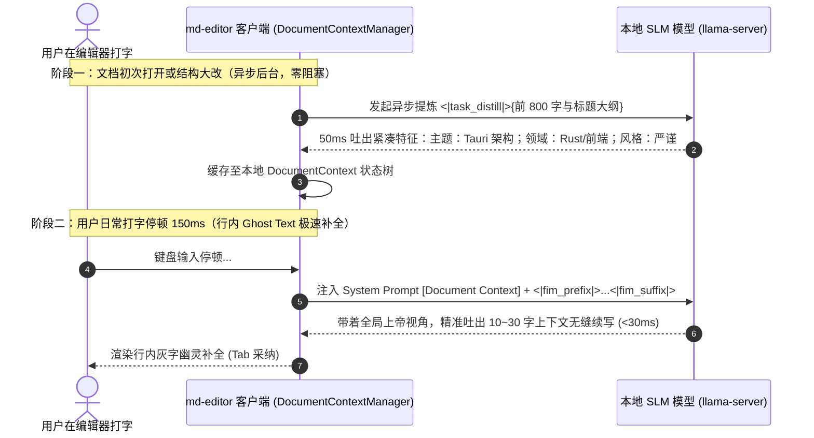

# RFC-002: md-editor 端侧专属小模型 (SLM) 客户端对接与实施终极规范

> **接收方**：[`wmasfoe/md-editor`](https://github.com/wmasfoe/md-editor) 桌面端 App 开发 Agent  
> **发送方**：[`wmasfoe/md-editor-models`](https://github.com/wmasfoe/md-editor-models) 模型微调工程 Agent  
> **技术架构**：Tauri v2 (Rust) + `llama-server` 本地进程通信  
> **当前状态**：Approved Final Specification（包含异步语义提炼 `<|task_distill|>` 与 ChatML 全局大纲条件化架构）  

---

## 1. 架构总览：双层解耦协同流水线

针对端侧小模型（0.5B / 1.5B）容易受限于局部视野导致续写发散的问题，本项目采用**「异步后台语义提炼」与「行内实时极速续写」的双层解耦架构**：



---

## 2. 双方确认的 7 大核心协议与实施标准

### 协议一：异步文档语义提炼任务 (`<|task_distill|>`)

#### 1.1 任务定义与触发时机
* **触发时机**：用户新建文档、切换文档、或单次粘贴/修改字数 $>300$ 时，客户端在后台静默发起一次提炼请求（**绝不阻塞主线程打字**）；
* **输入格式**：
  ```text
  <|task_distill|># Tokio 异步运行时架构解析
  ## 核心组件与任务调度
  在多线程异步运行时中，Tokio 通过工作窃取队列实现了高并发吞吐...
  ```
* **模型输出规范（30~50 Tokens，50ms 内返回）**：
  ```text
  主题：Tokio 异步运行时与工作窃取机制；领域：Rust 后端开发；风格：技术解析。
  ```

---

### 协议二：全任务 ChatML System Prompt `[Document Context]` 注入

客户端向模型发起日常补全（FIM）或纠错（GEC）时，在 `system` prompt 中结构化注入全局先验信息：

#### 标准 FIM 请求结构：
```text
<|im_start|>system
[User Style Profile]
- Language: Mixed (zh-en)
- Preferred: TypeScript, Rust, Markdown
- Tone: Technical Markdown

[Document Context]
- Title: Tauri 本地小模型架构设计
- Outline: 1. 核心选型 > 2. 进程通信 > 3. 内存释放策略
- Topic: 介绍如何在 Tauri 桌面端集成 llama.cpp 运行时与生命周期管理
<|im_end|>
<|im_start|>user
<|task_completion|><|fim_prefix|>针对内存占用过高的问题，我们设计了<|fim_suffix|>以降低系统常驻开销。<|fim_middle|>
<|im_end|>
<|im_start|>assistant
动态权重置换与按需唤醒调度机制，
<|im_end|>
```

---

### 协议三：强化 PSM 后缀约束与续写长度截断

#### 3.1 PSM (Prefix-Suffix-Middle) 后缀强约束
* 模型训练时 **60% 样本带有非空 `<|fim_suffix|>` 强约束**；
* 模型生成的 `<|fim_middle|>` 必须与 `suffix` 原文严丝合缝平滑衔接，**严禁生成与 suffix 重复的词汇**。

#### 3.2 长度控制与 Stop Tokens
* **行内补全 (Ghost Text)**：每次补全长度严格限制在 **10 ~ 30 字（半句至 1 完整句）**；
* **截断停止词**：遇到 `\n`、句末标点、代码围栏（`` ` ``、`#`）或 `<|fim_end|>` 立即终止。

---

### 协议四：局部 Diff 语法（紧凑元组 JSON）与 GEC 空输出标准

所有语法纠错与排版任务输出统一采用 **标准紧凑元组 JSON**：

$$\text{格式：} [[start, end, "\text{待替换原文}", "\text{替换后文本}"], ...]$$

#### 4.1 边界场景与空输出约定
| 场景类型 | 格式语法 | 边界特征 | 示例说明 |
| :--- | :--- | :--- | :--- |
| **标准替换** | `[[start, end, "原文", "新文"]]` | `start < end`, 两字符串非空 | `[[8, 9, "但", "因"]]` |
| **纯删除 (删多余字)** | `[[start, end, "多余内容", ""]]` | `start < end`, `repl === ""` | `[[8, 10, "多余", ""]]` |
| **纯插入 (补漏字)** | `[[start, start, "", "插入内容"]]` | `start === end`, `orig === ""` | `[[8, 8, "", "并且"]]` |
| **无错误 / 无需修改** | `[]` | **空数组 / 直接命中 EOS** | `[]` (1ms 快速释放 Slot) |

---

### 协议五：Task Control Tokens 完整注册清单

| 任务类型 | 专用控制 Token | 作用说明 |
| :--- | :--- | :--- |
| **文档语义提炼** | `<|task_distill|>` | 异步后台提取文档的主题、领域与风格 |
| **行内 FIM 续写** | `<|task_completion|>` + `<|fim_prefix|>...<|fim_suffix|>...<|fim_middle|>` | 行内 Ghost Text 补全 |
| **中文语法纠错** | `<|task_gec_zh|>` | 中文病句、搭配不当、错别字修正 |
| **英文语法纠错** | `<|task_gec_en|>` | 英文时态、主谓一致、单复数修正 |
| **日/韩/俄/法纠错** | `<|task_gec_ja|>`, `<|task_gec_ko|>`, `<|task_gec_ru|>`, `<|task_gec_fr|>` | 多语种拼写与助词纠错 |
| **标点与排版规范** | `<|task_punc|>` | 盘古之白中英空格、全半角标点纠正 |
| **格式保真** | `<|task_preserve|>` | LaTeX 公式、表格、YAML Frontmatter 结构保护 |

---

### 协议六：语料 1:1 双轨平衡配比 (50% 日常生活 + 50% 专业技术)

拒绝偏科与人工假模板，全部采用 Hugging Face 权威真实开源语料（`wikimedia/wikipedia`、`smollm-corpus`、`BelleGroup`、`the-stack`）：

```
┌────────────────────────────────────────────────────────────────────────┐
│               25,000 条真实开源语料全场景配比图                        │
├───────────────────────────────────┬────────────────────────────────────┤
│ 🏠 日常生活与通用写作 (50%)       │ 💻 专业技术与工程写作 (50%)        │
│                                   │                                    │
│ • 生活随笔与旅行日记 (15%)        │ • 编程与开源技术文档 (25%)         │
│   (旅行攻略/美食探店/摄影感悟)    │   (代码围栏/API/环境配置/Git)      │
│ • 职场办公与协作管理 (15%)        │ • 系统架构与设计规范 (15%)         │
│   (会议纪要/周报月报/待办任务)    │   (架构RFC/方案对比/流程设计)      │
│ • 生活指南与美食健康 (10%)        │ • 学术公式与复杂表格 (10%)         │
│   (烘焙食谱/健身打卡/居家收纳)    │   (LaTeX公式/对比表格/数据统计)    │
│ • 人文常识与读书笔记 (10%)        │                                    │
│   (名著书评/电影感悟/历史哲学)    │                                    │
└───────────────────────────────────┴────────────────────────────────────┘
```

---

### 协议七：GGUF 产物与 Release 多模型聚合 Manifest 规范

每一个 Release Tag（如 `v1.0.0`）下聚合该版本所有模型规格，附带的统一 `manifest.json`：

```json
{
  "version": "1.0.0",
  "updatedAt": "2026-09-01T17:50:00Z",
  "contextSize": 8192,
  "languages": ["zh", "en", "ja", "ko", "ru", "fr"],
  "specialTokens": {
    "distill": "<|task_distill|>",
    "completion": "<|task_completion|>",
    "fimPrefix": "<|fim_prefix|>",
    "fimSuffix": "<|fim_suffix|>",
    "fimMiddle": "<|fim_middle|>",
    "fimEnd": "<|fim_end|>",
    "gecZh": "<|task_gec_zh|>",
    "gecEn": "<|task_gec_en|>",
    "punc": "<|task_punc|>",
    "preserve": "<|task_preserve|>"
  },
  "models": [
    {
      "modelId": "qwen2.5-0.5b-editor",
      "tier": "lite",
      "displayName": "Qwen 2.5 0.5B (轻量极速版)",
      "description": "首字延迟 <30ms，内存仅占 280MB，适合所有轻薄本与日常流畅写作",
      "quant": "Q4_K_M",
      "filename": "qwen2.5-0.5b-editor-v1.0.0-Q4_K_M.gguf",
      "sizeBytes": 251658240,
      "sha256": "8f9b2c3d4e5f...",
      "downloadUrl": "https://github.com/wmasfoe/md-editor-models/releases/download/v1.0.0/qwen2.5-0.5b-editor-v1.0.0-Q4_K_M.gguf",
      "recommended": true
    },
    {
      "modelId": "qwen2.5-1.5b-editor",
      "tier": "standard",
      "displayName": "Qwen 2.5 1.5B (高精度进阶版)",
      "description": "更强长文连贯性与复杂代码续写能力，推荐 M 系列 Mac 或高配 PC",
      "quant": "Q4_K_M",
      "filename": "qwen2.5-1.5b-editor-v1.0.0-Q4_K_M.gguf",
      "sizeBytes": 1027604480,
      "sha256": "4a5e6f7b8c9d...",
      "downloadUrl": "https://github.com/wmasfoe/md-editor-models/releases/download/v1.0.0/qwen2.5-1.5b-editor-v1.0.0-Q4_K_M.gguf",
      "recommended": false
    }
  ]
}
```

---

## 3. 客户端 TypeScript 参考实现（Diff 解析与坐标转换）

```typescript
type DiffTuple = [number, number, string, string]; // [start, end, original, replacement]

/**
 * 将 Unicode Code Point 字符数转换为 JS/CodeMirror 6 的 UTF-16 Code Unit 偏移
 */
export function codePointOffsetToUtf16Offset(str: string, codePointIndex: number): number {
  let codePointCount = 0;
  let utf16Offset = 0;
  for (const char of str) {
    if (codePointCount >= codePointIndex) break;
    utf16Offset += char.length;
    codePointCount += 1;
  }
  return utf16Offset;
}

/**
 * 原生 JSON.parse 解析 Diff 并按 start 倒序安全切片替换
 */
export function parseAndApplyDiffs(fullText: string, modelOutput: string): string {
  if (!modelOutput || modelOutput.trim() === "" || modelOutput.trim() === "[]") {
    return fullText;
  }

  let diffs: DiffTuple[];
  try {
    diffs = JSON.parse(modelOutput);
    if (!Array.isArray(diffs) || diffs.length === 0) return fullText;
  } catch (e) {
    console.warn("模型输出非合法元组 JSON:", modelOutput);
    return fullText;
  }

  // 强制按 start 降序排序，防止前面替换影响后续字符下标
  diffs.sort((a, b) => b[0] - a[0]);

  let result = fullText;
  const codePoints = Array.from(fullText);

  for (const [start, end, original, replacement] of diffs) {
    const currentSlice = codePoints.slice(start, end).join('');
    
    if (currentSlice === original) {
      const u16Start = codePointOffsetToUtf16Offset(result, start);
      const u16End = codePointOffsetToUtf16Offset(result, end);
      result = result.slice(0, u16Start) + replacement + result.slice(u16End);
    } else {
      // 模糊纠偏：在 ±5 字符窗口内查找唯一匹配
      const windowStart = Math.max(0, start - 5);
      const windowEnd = Math.min(codePoints.length, end + 5);
      const windowText = codePoints.slice(windowStart, windowEnd).join('');
      const localIdx = windowText.indexOf(original);

      if (localIdx !== -1 && windowText.indexOf(original, localIdx + 1) === -1) {
        const actualCodePointStart = windowStart + localIdx;
        const actualCodePointEnd = actualCodePointStart + Array.from(original).length;
        const u16Start = codePointOffsetToUtf16Offset(result, actualCodePointStart);
        const u16End = codePointOffsetToUtf16Offset(result, actualCodePointEnd);
        result = result.slice(0, u16Start) + replacement + result.slice(u16End);
      }
    }
  }

  return result;
}
```

---

本规范已作为双方仓库的最终接口契约在模型端固化，所有产物与训练逻辑 100% 遵照执行。
