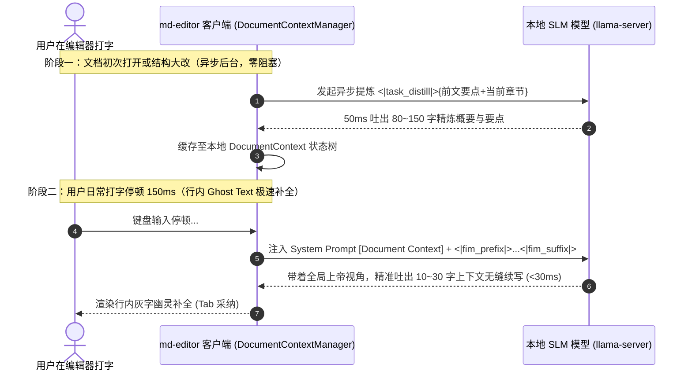

# RFC-002: md-editor 端侧专属小模型 (SLM) 客户端对接与实施终极规范

> **接收方**：[`wmasfoe/md-editor`](https://github.com/wmasfoe/md-editor) 桌面端 App 开发 Agent  
> **发送方**：[`wmasfoe/md-editor-models`](https://github.com/wmasfoe/md-editor-models) 模型微调工程 Agent  
> **技术架构**：Tauri v2 (Rust) + `llama-server` 本地进程通信  
> **当前状态**：Approved Final Specification（含 `<|task_gec_mixed|>`、滚动 Refine `<|task_distill|>`、ChatML `<|task_completion|>` 与 Stop Tokens 规范表）  

---

## 1. 架构总览：双层解耦协同流水线

针对端侧小模型（0.5B / 1.5B）容易受限于局部视野导致续写发散的问题，本项目采用**「异步后台语义提炼」与「行内实时极速续写」的双层解耦架构**：



---

## 2. 双方确认的 8 大核心协议与实施标准

### 协议一：Special Tokens 完整定义与注册表

```typescript
/** 文档全局/分段语义提炼 */
export const TASK_DISTILL = "<|task_distill|>";

/** GEC 语法纠错三态任务控制符 */
export const TASK_GEC_MIXED = "<|task_gec_mixed|>"; // 【本次新增】中英文混排专项
export const TASK_GEC_ZH = "<|task_gec_zh|>";       // 纯中文语境
export const TASK_GEC_EN = "<|task_gec_en|>";       // 纯英文语境
export const TASK_GEC_JA = "<|task_gec_ja|>";       // 日语拼写与助词
export const TASK_GEC_KO = "<|task_gec_ko|>";       // 韩语拼写
export const TASK_GEC_RU = "<|task_gec_ru|>";       // 俄语语法
export const TASK_GEC_FR = "<|task_gec_fr|>";       // 法语拼写与时态
export const TASK_PUNC = "<|task_punc|>";           // 纯标点与空格排版
export const TASK_PRESERVE = "<|task_preserve|>";   // Markdown/LaTeX 结构保真

/** FIM 行内续写补全控制符 */
export const TASK_COMPLETION = "<|task_completion|>";
export const FIM_PREFIX = "<|fim_prefix|>";
export const FIM_SUFFIX = "<|fim_suffix|>";
export const FIM_MIDDLE = "<|fim_middle|>";
export const FIM_END = "<|fim_end|>";
```

---

### 协议二：中英文混排专项纠错任务 (`<|task_gec_mixed|>`)

#### 2.1 任务目标与触发语境
* **核心目标**：纠正盘古之白（中英空格）、专业术语拼写、英文大小写/冠词、中英标点一致性以及中文语病。
* **输入 Prompt**：
  ```text
  <|im_start|>user
  <|task_gec_mixed|>今天学习了 this is a Apple，并调用了 Tauri 的 inovke 方法<|im_end|>
  <|im_start|>assistant
  ```
* **目标输出（紧凑元组 JSON）**：
  ```json
  [[5, 5, "", " "], [14, 15, "a", "an"], [16, 21, "Apple", "apple"], [40, 46, "inovke", "invoke"], [50, 50, "", "。"]]
  ```
* **纠错效果**：`今天学习了 this is an apple，并调用了 Tauri 的 invoke 方法。`

---

### 协议三：文档语义提炼与滚动 Refine 任务 (`<|task_distill|>`)

#### 3.1 目标输出与长度
* **目标输出长度**：80 ~ 150 字（约 100 ~ 180 tokens，端侧 CPU 耗时 50ms 左右）；
* **输入格式（支持长篇滚动 Refine）**：
  ```text
  <|im_start|>user
  <|task_distill|>
  【文档全局大纲】
  1. 核心概念  2. 调度器实现  3. 性能调优  4. 总结压测

  【前文提炼要点】
  解析了 Rust 异步运行时的核心原理与调度器架构。

  【当前新增章节内容】
  3. 性能调优：通过自定义内存池减少堆分配开销，使用无锁队列优化工作窃取效率，最终在压测中达成 20 万 QPS。

  请将当前章节融合进前文要点，输出更新后的全篇概要（80~150字）：<|im_end|>
  <|im_start|>assistant
  ```
* **模型输出规范**：
  ```text
  主题：解析 Rust 异步运行时调度原理，并探讨无锁队列与内存池等高并发性能调优实践。
  核心要点：1. 阐明 Future 轮询与事件驱动核心机制；2. 讲解无锁工作窃取调度器实现；3. 演示内存池优化与 20 万 QPS 压测成果。
  领域与基调：系统编程 / 工程实战。
  ```

---

### 协议四：ChatML System 引导下的行内续写 (`<|task_completion|>`)

#### 4.1 请求结构（100% 命中 Prefix KV Cache）
```text
<|im_start|>system
[User Style Profile]
- Language: Mixed (zh-en)
- Preferred: TypeScript, Rust, Markdown
- Tone: Technical Markdown

[Document Context]
- Title: Rust 异步运行时实战
- Outline: 1. 核心概念 2. 调度器实现 3. 性能调优 4. 总结压测
- Topic: 解析 Rust 异步运行时调度原理，并探讨无锁队列与内存池等高并发性能调优实践。要点：1. Future 轮询机制；2. 无锁工作窃取调度器；3. 内存池与 20 万 QPS 压测。领域：系统编程/技术实战。
<|im_end|>
<|im_start|>user
<|task_completion|><|fim_prefix|>为了平衡各工作线程的负载，任务调度器引入了<|fim_suffix|>机制。<|fim_middle|>
<|im_end|>
<|im_start|>assistant
工作窃取（Work Stealing）<|fim_end|>
```

#### 4.2 PSM 后缀强约束与长度截断
* 训练集 **60% 样本带有非空 `<|fim_suffix|>` 强约束**，杜绝与后文重复；
* 每次续写长度控制在 **10 ~ 30 字（半句至 1 完整句）**。

---

### 协议五：生成长度与 Stop Tokens 约定表

| 任务类型 | 目标生成长度 | 严格 Stop Tokens 列表 |
| :--- | :--- | :--- |
| **中英混排纠错 (`<|task_gec_mixed|>`)** | 紧凑元组 JSON | `["\n", "<|im_end|>", "<|endoftext|>", "<|fim_prefix|>"]` |
| **纯中文纠错 (`<|task_gec_zh|>`)** | 紧凑元组 JSON | `["\n", "<|im_end|>", "<|endoftext|>", "<|fim_prefix|>"]` |
| **纯英文纠错 (`<|task_gec_en|>`)** | 紧凑元组 JSON | `["\n", "<|im_end|>", "<|endoftext|>", "<|fim_prefix|>"]` |
| **多语种纠错 (`ja/ko/ru/fr`)** | 紧凑元组 JSON | `["\n", "<|im_end|>", "<|endoftext|>", "<|fim_prefix|>"]` |
| **文档提炼 (`<|task_distill|>`)** | 80 ~ 150 tokens | `["<|im_end|>", "<|endoftext|>"]` |
| **行内续写 (`<|task_completion|>`)** | 客户端 `max_tokens` (10~30) | `["\n", "<|fim_end|>", "<|im_end|>", "<|endoftext|>"]` |

---

### 协议六：局部 Diff 语法（紧凑元组 JSON）与 GEC 空输出标准

所有语法纠错与排版任务输出统一采用 **标准紧凑元组 JSON**：

$$\text{格式：} [[start, end, "\text{待替换原文}", "\text{替换后文本}"], ...]$$

* **无错误 / 无需修改**：直接返回 `[]` 或立即命中 EOS，严禁“无病呻吟”瞎改。

---

### 协议七：语料 1:1 双轨平衡配比 (50% 日常生活 + 50% 专业技术)

拒绝偏科与人工假模板，全部采用 Hugging Face 权威真实开源语料（`wikimedia/wikipedia`、`smollm-corpus`、`BelleGroup`、`the-stack`）：

```
┌────────────────────────────────────────────────────────────────────────┐
│               25,000 条真实开源语料全场景配比图                        │
├───────────────────────────────────┬────────────────────────────────────┤
│ 🏠 日常生活与通用写作 (50%)       │ 💻 专业技术与工程写作 (50%)        │
│                                   │                                    │
│ • 生活随笔与旅行日记 (15%)        │ • 编程与开源技术文档 (25%)         │
│   (旅行攻略/美食探店/摄影感悟)    │   (代码围栏/API/环境配置/Git)      │
│ • 职场办公与协作管理 (15%)        │ • 系统架构与设计规范 (15%)         │
│   (会议纪要/周报月报/待办任务)    │   (架构RFC/方案对比/流程设计)      │
│ • 生活指南与美食健康 (10%)        │ • 学术公式与复杂表格 (10%)         │
│   (烘焙食谱/健身打卡/居家收纳)    │   (LaTeX公式/对比表格/数据统计)    │
│ • 人文常识与读书笔记 (10%)        │                                    │
│   (名著书评/电影感悟/历史哲学)    │                                    │
└───────────────────────────────────┴────────────────────────────────────┘
```

---

### 协议八：GGUF 产物与 Release 多模型聚合 Manifest 规范

每个 Release Tag（如 `v1.0.0`）下挂载多规格模型与统一 `manifest.json`：

```json
{
  "version": "1.0.0",
  "updatedAt": "2026-09-01T18:30:00Z",
  "contextSize": 8192,
  "languages": ["zh", "en", "ja", "ko", "ru", "fr"],
  "specialTokens": {
    "distill": "<|task_distill|>",
    "completion": "<|task_completion|>",
    "gecMixed": "<|task_gec_mixed|>",
    "gecZh": "<|task_gec_zh|>",
    "gecEn": "<|task_gec_en|>",
    "fimPrefix": "<|fim_prefix|>",
    "fimSuffix": "<|fim_suffix|>",
    "fimMiddle": "<|fim_middle|>",
    "fimEnd": "<|fim_end|>",
    "punc": "<|task_punc|>",
    "preserve": "<|task_preserve|>"
  },
  "models": [
    {
      "modelId": "qwen2.5-0.5b-editor",
      "tier": "lite",
      "displayName": "Qwen 2.5 0.5B (轻量极速版)",
      "description": "首字延迟 <30ms，内存仅占 280MB，适合所有轻薄本与日常流畅写作",
      "quant": "Q4_K_M",
      "filename": "qwen2.5-0.5b-editor-v1.0.0-Q4_K_M.gguf",
      "sizeBytes": 251658240,
      "sha256": "8f9b2c3d4e5f...",
      "downloadUrl": "https://github.com/wmasfoe/md-editor-models/releases/download/v1.0.0/qwen2.5-0.5b-editor-v1.0.0-Q4_K_M.gguf",
      "recommended": true
    },
    {
      "modelId": "qwen2.5-1.5b-editor",
      "tier": "standard",
      "displayName": "Qwen 2.5 1.5B (高精度进阶版)",
      "description": "更强长文连贯性与复杂代码续写能力，推荐 M 系列 Mac 或高配 PC",
      "quant": "Q4_K_M",
      "filename": "qwen2.5-1.5b-editor-v1.0.0-Q4_K_M.gguf",
      "sizeBytes": 1027604480,
      "sha256": "4a5e6f7b8c9d...",
      "downloadUrl": "https://github.com/wmasfoe/md-editor-models/releases/download/v1.0.0/qwen2.5-1.5b-editor-v1.0.0-Q4_K_M.gguf",
      "recommended": false
    }
  ]
}
```

---

## 3. 客户端 TypeScript 参考实现（Diff 解析与坐标转换）

```typescript
type DiffTuple = [number, number, string, string]; // [start, end, original, replacement]

/**
 * 将 Unicode Code Point 字符数转换为 JS/CodeMirror 6 的 UTF-16 Code Unit 偏移
 */
export function codePointOffsetToUtf16Offset(str: string, codePointIndex: number): number {
  let codePointCount = 0;
  let utf16Offset = 0;
  for (const char of str) {
    if (codePointCount >= codePointIndex) break;
    utf16Offset += char.length;
    codePointCount += 1;
  }
  return utf16Offset;
}

/**
 * 原生 JSON.parse 解析 Diff 并按 start 倒序安全切片替换
 */
export function parseAndApplyDiffs(fullText: string, modelOutput: string): string {
  if (!modelOutput || modelOutput.trim() === "" || modelOutput.trim() === "[]") {
    return fullText;
  }

  let diffs: DiffTuple[];
  try {
    diffs = JSON.parse(modelOutput);
    if (!Array.isArray(diffs) || diffs.length === 0) return fullText;
  } catch (e) {
    console.warn("模型输出非合法元组 JSON:", modelOutput);
    return fullText;
  }

  // 强制按 start 降序排序，防止前面替换影响后续字符下标
  diffs.sort((a, b) => b[0] - a[0]);

  let result = fullText;
  const codePoints = Array.from(fullText);

  for (const [start, end, original, replacement] of diffs) {
    const currentSlice = codePoints.slice(start, end).join('');
    
    if (currentSlice === original) {
      const u16Start = codePointOffsetToUtf16Offset(result, start);
      const u16End = codePointOffsetToUtf16Offset(result, end);
      result = result.slice(0, u16Start) + replacement + result.slice(u16End);
    } else {
      // 模糊纠偏：在 ±5 字符窗口内查找唯一匹配
      const windowStart = Math.max(0, start - 5);
      const windowEnd = Math.min(codePoints.length, end + 5);
      const windowText = codePoints.slice(windowStart, windowEnd).join('');
      const localIdx = windowText.indexOf(original);

      if (localIdx !== -1 && windowText.indexOf(original, localIdx + 1) === -1) {
        const actualCodePointStart = windowStart + localIdx;
        const actualCodePointEnd = actualCodePointStart + Array.from(original).length;
        const u16Start = codePointOffsetToUtf16Offset(result, actualCodePointStart);
        const u16End = codePointOffsetToUtf16Offset(result, actualCodePointEnd);
        result = result.slice(0, u16Start) + replacement + result.slice(u16End);
      }
    }
  }

  return result;
}
```
